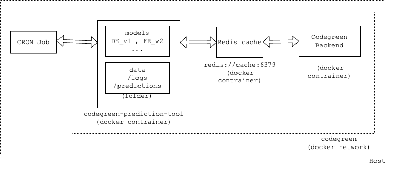

# Carbon efficient model deployment for project Codegreen

This repository provides a tool for deploying prediction models in a more environment friendly manner. This tool is designed to complement the Codegreen project.

[Project Codegreen](https://github.com/AnneHartebrodt/codegreen-client) allows users to time shift their computations to periods when a higher proportion of energy is produced from renewable energy source, thereby reducing the carbon footprint of their computation. This is achieved by leveraging forecasts of energy generation data obtained from open data sources.  

For example, in the European Union, data is colleted from the [ENTSOE](https://transparency.entsoe.eu/) platform. However, a significant challenge arise from the limited duration of the available energy production forecasts, typically spanning 24 hours, and the sporadic upload schedule. This unpredictability makes predicting the optimal time for long duration computational tasks difficult.  

One approach to address this challenge is to train prediction models using historical generation data that forecast the time series of renewable energy percentages on an hourly basis. Since each country's energy generation patterns are unique, separate models are needed for each country. As our understanding of energy patterns for individual countries improves, we should incorporate this into our models. Thus there can be multiple models for a single country.

Now the question arises : how do we deploy these models effectively so that prediction values can be seamlessly integrated into the main Codegreen API while minimizing carbon emissions? This project outlines one approach to do just that.   

# Architecture 

The figure below describes the overall architecture of deployment



The Codegreen backend utilizes a Redis server to cache forecast values for improved performance. We used this redis as a shared memory between the backend and our prediction tool.

We  create a docker container (named `codegreen-prediction-tool`) and add it to the docker network in where the Codegreen backend and other services operate. However this container does not run continuously. Instead, a CRON job starts the container after a specified time interval,  automatically triggering the execution of script for running models for all available countries and storing their results. Once this task is completed, the container stops automatically. 

The results of the models (the predictions) are send to the redis cache and stored in a local data folder. This folder ,which also includes logs, is accessible for sharing with the host machine. 


# Installation and setup
- **Pre-requisites**:
  - Docker must be installed 
  - The [Codegreen server](https://github.com/AnneHartebrodt/codegreen) must be up and running
  - Obtain the name of the Docker network in which the Codegreen containers exist. Use the command `docker network ls`. Usually, the default network name is `projectfoldername_default`.
- **Clone the repository** : `git clone https://github.com/shubhvjain/codegreen-prediction-tool.git`. All further steps must be performed from the root of the project folder. 
- **Create a config file** : 
  - Create a new file named  `.config`  in the root of the project repository
  - Initialize the file will the following envirenment variables:
  ```env
  ENTSOE_TOKEN=token
  PREDICTIONS_REDIS_URL="redis://cache:6379"
  PREDICTIONS_CRON_JOB_FREQ_HOUR=1
  PREDICTIONS_DOCKER_VOLUME_PATH="/full/local/path"
  GREENERAI_DOCKER_NETWORK=greenerai_default
  ```
  
- **Initial setup** :  Execute the initial setup by running `./setup.sh`.
  - **Note** : This command must be run again if config files are changed
  - **Test run the program** : Before configuring the cron job, ensure everything is properly set up by running `./run.sh`. If the setup is correct, you will find log files of models run successfully in the path specified in the config file.
- **Setting up the cron job** : Execute `./schedule.sh` to set up the cron job. The frequency of the job is determined by the `PREDICTIONS_CRON_JOB_FREQ_HOUR` variable in the `.config` file.

# Development 

## The `.config` file
All configuration setting required by the tool are stored in the config file in the root of the project folder
Essentially, this file contains environment variables that are then loaded before running the main program 
- Description of each variable required in the `.config` file:
  - `ENTSOE_TOKEN`: Token required to access the ENTSO-E API.
  - `PREDICTIONS_REDIS_URL`: The URL of the common Redis server. Use "redis://cache:6379".
  - `PREDICTIONS_CRON_JOB_FREQ_HOUR`: The frequency (in hours) of the CRON job configured in the last step of installation.
  - `PREDICTIONS_DOCKER_VOLUME_PATH`: The full path on the host machine where the recent prediction files and log files will be stored.
  - `GREENERAI_DOCKER_NETWORK`: The name of the Docker network in which CodeGreen containers are running.

## How to add a new model ?